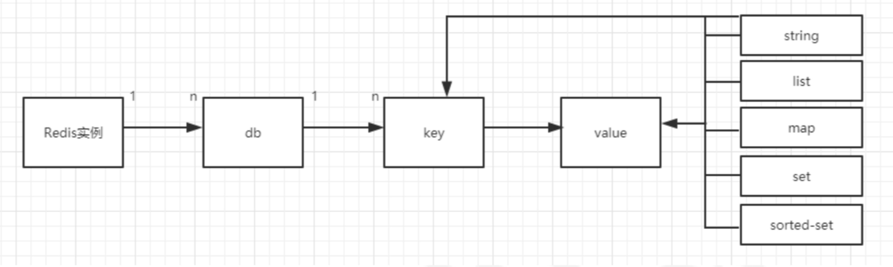
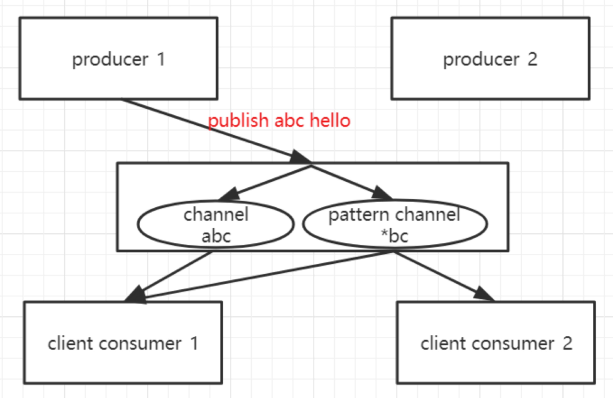

# Redis 学习笔记

姓名：杨雲腾  学号：18302010022

## Redis简介

Redis是完全开源的，遵守BSD协议，是一个高性能的key-value数据库;通过提供多种键值数据类型来适应不同场景下的缓存与存储需求。Redis默认支持16个“数据库”，即db分为16个部分，类似于命名空间，并不是完全的隔离，我们可以在任意一个命名空间中创建key和value。（可以通过SELECT num来切换数据库）

### Redis本身的特点

1. Redis虽然本身是内存数据库，但是支持数据的持久化，可以将数据保存在内存中（也就是我们在redis安装目录下可以看见dump.rdb,这就是序列化后二进制存储文件）
2. Redis不仅仅支持简单的key-value类型数据，他同时还提供了hash,list,set,zset等复杂的数据结构
3. Redis支持数据的备份（采用的是master-slave模式的数据备份）
4. Redis具有丰富的特性，Redis还支持publish/subscribe（SUBSCRIBE和PUBLISH命令）,通知，key过期（可以通过EXPIRE等命令设置过期时间）等特性

## Redis存储结构

我对于redis个人理解，就是一个存储在内存中巨大的字典结构（常见的字典结构，比如map,通过key-value存储），redis的全称是remote dictionary server(远程字典服务)，以字典结构存储数据，并允许其他应用通过tcp协议读取字典中数据，数据结构如下：



## Redis数据类型

支持五种数据类型，string(字符串)，hash(哈希)，list(列表)，set(集合)，zset(sorted set: 有序集合)

如果想要对于redis的命令进行查找，

[redis 命令大全]: https://redis.io/commands


## Redis常用功能原理分析

### 过期时间设置

在Redis中提供了Expire命令设置一个键的过期时间，到期以后Redis会自动删除它。这个在我们实际使用过程中用得非常多。
EXPIRE命令的使用方法为

```
EXPIRE key seconds
```

其中seconds 参数表示键的过期时间，单位为秒。EXPIRE 返回值为1表示设置成功，0表示设置失败或者键不存在。

如果向知道一个键还有多久时间被删除，可以使用TTL命令。

```
TTL key
```

当键不存在时，TTL命令会返回-2，而对于没有给指定键设置过期时间的，通过TTL命令会返回-1。

如果想取消键的过期时间设置(使该键恢复成为永久的)，可以使用PERSIST命令，如果该命令执行成功或者成功清除了过期时间，则返回1。否则返回0(键不存在或者本身就是永久的)。

EXPIRE命令的seconds命令必须是整数，所以最小单位是1秒，如果向要更精确的控制键的过期时间可以使用 PEXPIRE命令。
PEXPIRE命令的单位是毫秒。即PEXPIRE key 1000与EXPIRE key 1相等。对应的PTTL以毫秒单位获取键的剩余有效时间。

还有一个针对字符串独有的过期时间设置方式

```
setex(String key,int seconds,String value)
```

### 过期删除的原理

Redis 删除失效主键的方法主要有两种:

消极方法(passive way)
在主键被访问时如果发现它已经失效，那么就删除它。

积极方法(active way)
周期性地从设置了失效时间的主键中选择一部分失效的主键删除。

对于那些从未被查询的key，即便它们已经过期，被动方式也无法清除。因此Redis会周期性地随机测试一些key，已过期的key将会被删掉。Redis每秒会进行10次操作，具体的流程：

> 1.随机测试 20 个带有timeout信息的key。
> 2.删除其中已经过期的key。
> 3.如果超过25%的key被删除，则重复执行步骤1。

这是一个简单的概率算法(trivial probabilistic algorithm)，基于假设我们随机抽取的key代表了全部的key空间。

### 发布订阅

Redis提供了发布订阅功能，可以用于消息的传输，Redis提供了一组命令可以让开发者实现“发布/订阅”模式 (publish/subscribe)，该模式同样可以实现进程间的消息传递。发布/订阅模式包含两种角色，分别是发布者和订阅者。订阅者可以订阅一个或多个频道，而发布者可以向指定的频道发送消息，所有订阅此频道的订阅者都会收到该消息。
发布者发布消息的命令是PUBLISH，用法是

```
PUBLISH channel message  
```

比如向channel_1发一条消息:hello

```
PUBLISH channel_1 “hello”  
```

这样就实现了消息的发送，该命令的返回值表示接收到这条消息的订阅者数量。因为在执行这条命令的时候还没有订阅者订阅该频道，所以返回为0。另外值得注意的是消息发送出去不会持久化，如果发送之前没有订阅者，那么后续再有订阅者订阅该频道，之前的消息就收不到了。
订阅者订阅消息的命令是

```
SUBSCRIBE channel [channel ...]  
```

该命令同时可以订阅多个频道，比如订阅channel_1的频道：

```
SUBSCRIBE channel_1  
```

执行SUBSCRIBE命令后客户端会进入订阅状态。

结构图
channel分两类，一个是普通channel、另一个是pattern channel(规则匹配)， producer1发布了一条消息 【publish abc hello】,redis server发给abc这个普通channel上的所有订阅者，同时abc也匹配上了pattern channel的名字，所以这条消息也会同时发送给pattern channel *bc上的所有订阅者。



实现效果


### 数据持久化

Redis支持两种方式的持久化，一种是RDB(Redis DataBase)方式、另一种是AOF(Append-Only-File)方式。前者会根据指定的规则“定时”将内存中的数据存储在硬盘上，而后者在每次执行命令后将命令本身记录下来。两种持久化方式可以单独使用其中一种，也可以将这两种方式结合使用。

#### RDB方式

当符合一定条件时，Redis会单独创建(fork)一个子进程来进行持久化，会先将数据写入到一个临时文件中，等到持久化过程都结束了，再用这个临时文件替换上次持久化好的文件。整个过程中，主进程是不进行任何IO操作的，这就确保了极高的性能。

如果需要进行大规模数据的恢复，且对于数据恢复的完整性不是非常敏感，那RDB方式要比AOF方式更加的高效。

RDB的缺点是最后一次持久化后的数据可能丢失。(假如在最后一次数据备份期间，系统宕机，那在此期间所有的数据都会丢失)

fork的作用是复制一个与当前进程一样的进程。新进程的所有数据(变量、环境变量、程序计数器等)数值都和原进程一致，但是是一个全新的进程，并作为原进程的子进程。 Redis会在以下几种情况下对数据进行快照

> 1.根据配置规则进行自动快照
> 2.用户执行SAVE或者GBSAVE命令
> 3.执行FLUSHALL命令
> 4.执行复制(replication)时

##### 根据配置规则进行自动快照

Redis允许用户自定义快照条件，当符合快照条件时，Redis会自动执行快照操作。快照的条件可以由用户在配置文件中配置。配置格式如下

```
save 900 1  
save 300 10
save 60 10000
```

第一个参数是时间窗口，第二个是键的个数，也就是说，在第一个时间参数配置范围内被更改的键的个数大于后面的changes时，即符合快照条件。redis默认配置了以上三个规则。每条快照规则占一行，每条规则之间是“或”的关系。 在900秒(15分)内有一个以上的键被更改则进行快照。

##### 用户执行SAVE或BGSAVE命令

除了让Redis自动进行快照以外，当我们对服务进行重启或者服务器迁移我们需要人工去干预备份。redis提供了两条命令来完成这个任务。

1.save命令
当执行save命令时，Redis同步做快照操作，在快照执行过程中会阻塞所有来自客户端的请求。当redis内存中的数据较多时，通过该命令将导致Redis较长时间的不响应。所以不建议在生产环境上使用这个命令，而是推荐使用 bgsave命令。

2.bgsave命令
bgsave命令可以在后台异步地进行快照操作，快照的同时服务器还可以继续响应来自客户端的请求。执行BGSAVE后，Redis会立即返回ok表示开始执行快照操作。
通过LASTSAVE命令可以获取最近一次成功执行快照的时间(自动快照采用的是异步快照操作)。

##### 执行FLUSHALL命令

该命令会清除redis在内存中的所有数据。执行该命令后，只要redis中配置的快照规则不为空，也就是save的规则存在，redis就会执行一次快照操作。不管规则是什么样的都会执行。如果没有定义快照规则，就不会执行快照操作。

##### 执行复制时

该操作主要是在主从模式下，redis会在复制初始化时进行自动快照。当执行复制操作时，即使没有定义自动快照规则，并且没有手动执行过快照操作，它仍然会生成RDB快照文件。

#### AOF方式

当使用Redis存储非临时数据时，一般需要打开AOF持久化来降低进程终止导致的数据丢失。AOF可以将Redis执行的每一条写命令追加到硬盘文件中，这一过程会降低Redis的性能，但大部分情况下这个影响是能够接受的，另外使用较快的硬盘可以提高AOF的性能。

##### 开启AOF

默认情况下Redis没有开启AOF方式的持久化，可以通过appendonly参数启用，在redis.conf (如果是windows 系统则是redis.windows.conf)中找到 appendonly将no修改为yes
AOF文件的保存位置和RDB文件的位置相同，都是通过dir参数设置的，默认的文件名是apendonly.aof。可以修改redis.conf 中的属性 appendfilename appendonlyh.aof 来修改文件名。


##### AOF的实现

AOF文件以纯文本的形式记录Redis执行的写命令例如开启AOF持久化的情况下执行如下4条命令

```
set foo 1  
set foo 2  
set foo 3  
get  
```

redis 会将前3条命令写入AOF文件中，通过vim的方式可以看到aof文件中的内容。
可以发现AOF文件的内容正是Redis发送的原始通信协议的内容，从内容中我们发现Redis只记录了3条命令。然后这时有一个问题是前面2条命令其实是冗余的，因为这两条的执行结果都会被第三条命令覆盖。随着执行的命令越来越多，AOF文件的大小也会越来越大，其实内存中实际的数据可能没有多少，那这样就会造成磁盘空间以及redis数据还原的过程比较长的问题。因此我们希望Redis可以自动优化 AOF文件，就上面这个例子来说，前面两条是可以被删除的。而实际上Redis也考虑到了，可以配置一个条件，每当达到一定条件时Redis就会自动重写AOF文件，这个条件的配置为

```
auto-aof-rewrite-percentage 100 
auto-aof-rewrite-min-size 64mb。  
```

auto-aof-rewrite-percentage 表示的是当目前的AOF文件大小超过上一次重写时的AOF文件大小的百分之多少时会再次进行重写，如果之前没有重写过，则以启动时AOF文件大小为依据。
auto-aof-rewrite-min-size 表示限制了允许重写的最小AOF文件大小，通常在AOF文件很小的情况下即使其中有很多冗余的命令我们也并不太关心。
另外，还可以通过BGREWRITEAOF 命令手动执行AOF，执行完以后冗余的命令已经被删除了。


在启动时，Redis会逐个执行AOF文件中的命令来将硬盘中的数据载入到内存中，载入的速度相对于RDB会慢一些。

##### AOF的重写原理

Redis 可以在 AOF 文件体积变得过大时，自动地在后台对 AOF 进行重写。重写后的新 AOF 文件包含了恢复当前数据集所需的最小命令集合。
重写的流程是这样，主进程会fork一个子进程出来进行AOF重写，这个重写过程并不是基于原有的aof文件来做的，而是有点类似于快照的方式，全量遍历内存中的数据，然后逐个序列到aof文件中。在fork子进程这个过程中，服务端仍然可以对外提供服务，那这个时候重写的aof文件的数据和会redis内存数据不一致。于是在这个过程中，主进程的数据更新操作，会缓存到aof_rewrite_buf中，也就是单独开辟一块缓存来存储重写期间收到的命令，当子进程重写完以后再把缓存中的数据追加到新的aof文件。
当所有的数据全部追加到新的aof文件中后，把新的aof文件重命名为，此后所有的操作都会被写入新的aof文件。
如果在rewrite过程中出现故障，不会影响原来aof文件的正常工作，只有当rewrite完成后才会切换文件。因此这个rewrite过程是比较可靠的。

### 内存回收策略

Redis中提供了多种内存回收策略，当内存容量不足时，为了保证程序的运行，这时就不得不淘汰内存中的一些对象，释放这些对象占用的空间。
其中，默认的策略为noeviction策略，当内存使用达到阈值的时候，所有引起申请内存的命令会报错。

> allkeys-lru:从数据集(server.db[i].dict)中挑选最近最少使用的数据淘汰。
> 适用场景：如果我们的应用对缓存的访问都是相对热点的数据，可以选择这个策略。
> allkeys-random:随机移除某个key。
> volatile-random:从已设置过期时间的数据集(server.db[i].expires)中任意选择数据淘汰。
> volatile-lru:从已设置过期时间的数据集(server.db[i].expires)中挑选最近最少使用的数据淘汰。
> volatile-ttl:从已设置过期时间的数据集(server.db[i].expires)中挑选将要过期的数据淘汰。

实际上Redis实现的LRU并不是可靠的LRU，也就是名义上我们使用LRU算法淘汰内存数据，但是实际上被淘汰的键并不一定是真正的最少使用的数据。这里涉及到一个权衡的问题，如果需要在所有的数据中搜索最符合条件的数据，那么一定会增加系统的开销，Redis是单线程的，所以耗时的操作会谨慎一些。为了在一定成本内实现相对的 LRU，早期的Redis版本是基于采样的LRU，也就是放弃了从所有数据中搜索解改为采样空间搜索最优解。Redis3.0 版本之后，Redis作者对于基于采样的LRU进行了一些优化，目的是在一定的成本内让结果更靠近真实的LRU。


## Redis 事务ACID讨论

事务是一个数据库必备的元素，对于redis也不例外，对于一个传统的关系数据库，数据库事务满足ACID四个特性：

- A代表原子性：一个事务中所有的操作，要么全部完成，要么全部不完成，不会结束在中间某个环节（如果中间环节出现问题，数据库会回滚到事务开始前的状态）
- C代表一致性：事务应确保数据库的状态从一个一致状态转为另外一个一致状态。（一致的含义是数据库中的数据应满足完整性约束）
- I代表隔离性：多个事务并发执行，一个事务的执行不应影响其他事务的执行
- D代表持久性：已经被提交的事务对于事务的修改应该永久保存在数据库中

Redis的事务主要包括MULTI, EXEC, DISCARD和WATCH命令（MULTI: 开启事务 EXEC: 提交事务 DISCARD: 取消事务 WATCH:监视键（如果在事务执行期间，被监视的键被修改，那么事务会被打断））

### MULTI&EXEC

```shell
127.0.0.1:6379> MULTI
OK
127.0.0.1:6379> SET bookshop "CS bookshop"
QUEUED
127.0.0.1:6379> GET bookshop
QUEUED
127.0.0.1:6379> SADD book "C++" "Java" "Php"
QUEUED
127.0.0.1:6379> SMEMBERS book
QUEUED
127.0.0.1:6379> EXEC
1) OK
2) "CS bookshop"
3) (integer) 3
4) 1) "Php"
   2) "C++"
   3) "Java"
```

事务执行分为三个阶段

1. 开始事务
2. 命令入队
3. 执行事务

### WATCH 指令

| 时间 | 客户端A        | 客户端B       |
| ---- | -------------- | ------------- |
| T1   | WATCH name     |               |
| T2   | MULTI          |               |
| T3   | SET name peter |               |
| T4   |                | SET name john |
| T5   | EXEC           |               |

结果会执行出现nil (也就是设置失败)


在进行上述关于redis事务操作之后，redis产生错误，主要可以分为两类：

- 事务在执行EXEC之前，入队的命令可能是错误的（在redis2.6.5之后，事务在执行EXEC出现错误，这个事务会被放弃）
- 命令可能在EXEC失败（在EXEC之后出现的错误，会被忽略，其他正确命令继续执行）

并且redis事务是不支持回滚的（虽然这个有悖于我们对于数据库事务的理解，但是这也存在一定的合理性）

- Redis 命令只会因为错误的语法而失败，或者命令作用在错误的键上；也就是说，从实际使用情况下，错误会在开发过程中就得到解决
- 由于不需要支持回滚，redis的内部可以保持简单快速

### Redis事务ACID性质讨论

#### A 原子性

单个redis命令的执行是原子性的，但是redis 没有在事务上增加任何维持原子性的机制，所以redis事务的执行不支持原子性

如果一个事务队列中的所有命令都被成功的执行，你们称这个事务为成功;但是redis在执行事务的过程中被终止，你们事务执行失败，并且由于redis不支持回滚，所以redis不满足原子性中的要么全部执行，要么全部不执行

#### C 一致性

一致性分下面几种情况来讨论：

首先，如果一个事务的指令全部被执行，那么数据库的状态是满足数据库完整性约束的

其次，如果一个事务中有的指令有错误，这个事务会被放弃，那么数据库的状态是满足数据完整性约束的

最后，如果事务运行到某条指令时，进程被kill掉了，那么要分下面几种情况讨论：

- 如果当前redis采用的是内存模式，那么重启之后redis数据库是空的，那么满足一致性条件
- 如果当前采用RDB模式存储的，在执行事务时，Redis 不会中断事务去执行保存 RDB 的工作，只有在事务执行之后，保存 RDB 的工作才有可能开始。所以当 RDB 模式下的 Redis 服务器进程在事 务中途被杀死时，事务内执行的命令，不管成功了多少，都不会被保存到 RDB 文件里。 恢复数据库需要使用现有的 RDB 文件，而这个 RDB 文件的数据保存的是最近一次的数 据库快照（snapshot），所以它的数据可能不是最新的，但只要 RDB 文件本身没有因为 其他问题而出错，那么还原后的数据库就是一致的
- 如果当前采用的是AOF存储的，那么可能事务的内容还未写入到AOF文件，那么此时肯定是满足一致性的，如果事务的内容有部分写入到AOF文件中，那么需要用工具把AOF中事务执行部分成功的指令移除，这时，移除之后的AOF文件也是满足一致性的

所以，redis事务满足一致性约束

注释：关于rdb和aof这两种持久化方式，体现在实现方式上的不同，rdb通过将redis存储的数据生成快照并存储在磁盘介质上，而aof将redis执行过的所有写指令记录下来，在回复数据时重新执行一遍（redis默认的是采用rdb）

#### I 隔离性

Redis 是单进程程序，并且它保证在执行事务时，不会对事务进行中断，事务可以运行直到执行完所有事务队列中的命令为止。因此，Redis 的事务是总是带有隔离性的。

#### D 持久性

因为事务不过是用队列包裹起了一组 Redis 命令，并没有提供任何额外的持久性功能，所以事务的持久性由 Redis 所使用的持久化模式决定

- 在单纯的内存模式下，事务肯定是不持久的
- 在 RDB 模式下，服务器可能在事务执行之后、RDB 文件更新之前的这段时间失败，所以 RDB 模式下的 Redis 事务也是不持久的
- 在 AOF 的“总是 SYNC ”模式下，事务的每条命令在执行成功之后，都会立即调用 `fsync` 或 `fdatasync` 将事务数据写入到 AOF 文件。但是，这种保存是由后台线程进行的，主线程不会阻塞直到保存成功，所以从命令执行成功到数据保存到硬盘之间，还是有一段非常小的间隔，所以这种模式下的事务也是不持久的。


## Java Redis实践

Redis Java客户端已经有很多的开源产品如Redission、Jedis、lettuce

差异

1. Jedis是Redis的Java实现的客户端，其API提供了比较全面的Redis命令的支持。
2. Redisson实现了分布式和可扩展的Java数据结构，和Jedis相比，功能较为简单，不支持字符串操作，不支持排序、事务、管道、分区等Redis特性。Redisson主要是促进使用者对Redis的关注分离，从而让使用者能够将精力更集中地放在处理业务逻辑上。
3. lettuce是基于Netty构建的一个可伸缩的线程安全的Redis客户端，支持同步、异步、响应式模式。多个线程可以共享一个连接实例，而不必担心多线程并发问题。

此处简单实践了一下Jedis

对于Maven项目可以添加以下依赖

```xml
<!-- https://mvnrepository.com/artifact/redis.clients/jedis -->
<dependency>
    <groupId>redis.clients</groupId>
    <artifactId>jedis</artifactId>
    <version>3.6.0</version>
</dependency>

```

同样也可以下载jar包，在Intellij中导入来实现，下载网址：https://mvnrepository.com/artifact/redis.clients/jedis/3.6.0

关于redis接口文档 https://www.mklab.cn/onlineapi/jedis/

整理的比较好的redis接口博客（常用） https://blog.csdn.net/fanbaodan/article/details/89047909

### 1.jedis 键（key）操作

| 方法                                           | 描述                                    |
| ---------------------------------------------- | --------------------------------------- |
| jedis.flushDB                                  | 清空数据                                |
| boolean jedis.exists(String key)               | 判断某个键是否存在                      |
| jedis.set(String key,String value)             | 新增键值对（key,value）                 |
| `Set<String> jedis.keys(*)`                    | 获取所有key，匹配规则（正则）           |
| jedis.del(String key)                          | 删除键为key的数据项                     |
| jedis.expire(String key,int i)                 | 设置键为key的过期时间为i秒              |
| int jedis.ttl(String key)                      | 获取建委key数据项的剩余时间（秒）       |
| jedis.persist(String key)                      | 移除键为key属性项的生存时间限制         |
| jedis.type(String key)                         | 查看键为key所对应value的数据类型        |
| jedis.renamenx(String oldName, String newName) | 对于键进行重命名                        |
| jedis.dump(String key)                         | 获取对应key序列化后的值（类比DUMP命令） |

### 2.jedis 字符串操作

| 语法                                                  | 描述                                           |
| ----------------------------------------------------- | ---------------------------------------------- |
| jedis.set(String key,String value)                    | 增加（或覆盖）数据项                           |
| jedis.setnx(String key,String value)                  | 不覆盖增加数据项（重复的不插入）               |
| jedis.setex(String ,int t,String value)               | 增加数据项并设置有效时间                       |
| jedis.del(String key)                                 | 删除键为key的数据项                            |
| jedis.get(String key)                                 | 获取键为key对应的value                         |
| jedis.append(String key, String s)                    | 在key对应value 后边扩展字符串 s                |
| jedis.mset(String k1,String V1,String K2,String V2,…) | 增加多个键值对                                 |
| String[] jedis.mget(String K1,String K2,…)            | 获取多个key对应的value                         |
| `jedis.del(new String[](String K1,String K2,.... ))`  | 删除多个key对应的数据项                        |
| String jedis.getSet(String key,String value)          | 获取key对应value并更新value                    |
| String jedis.getrang(String key , int i, int j)       | 获取key对应value第i到j字符 ，从0开始，包头包尾 |

### 3.jedis 整数和浮点数操作

| 语法                             | 描述                  |
| -------------------------------- | --------------------- |
| jedis.incr(String key)           | 将key对应的value 加1  |
| jedis.incrBy(String key,int n)   | 将key对应的value 加 n |
| jedis.decr(String key)           | 将key对应的value 减1  |
| jedis.decrBy(String key , int n) | 将key对应的value 减 n |

### 4.jedis 列表（list）操作

| 语法                                                 | 描述                                                         |
| ---------------------------------------------------- | ------------------------------------------------------------ |
| `jedis.lpush(String key, String v1, String v2,....)` | 添加一个List , 注意：如果已经有该List对应的key, 则按顺序在左边追加 一个或多个 |
| jedis.rpush(String key , String vn)                  | key对应list右边插入元素                                      |
| jedis.lrange(String key,int i,int j)                 | 获取key对应list区间[i,j]的元素，注：从左边0开始，包头包尾    |
| jedis.lrem(String key,int n , String val)            | 删除list中 n个元素val                                        |
| jedis.ltrim(String key,int i,int j)                  | 删除list区间[i,j] 之外的元素                                 |
| jedis.lpop(String key)                               | key对应list ,左弹出栈一个元素                                |
| jedis.rpop(String key)                               | key对应list ,右弹出栈一个元素                                |
| jedis.lset(String key,int index,String val)          | 修改key对应的list指定下标index的元素                         |
| jedis.llen(String key)                               | 获取key对应list的长度                                        |
| jedis.lindex(String key,int index)                   | 获取key对应list下标为index的元素                             |
| jedis.sort(String key)                               | 把key对应list里边的元素从小到大排序 （后边详细介绍）         |

### 5.jedis 集合（Set）操作

| 语法                                              | 操作                            |
| ------------------------------------------------- | ------------------------------- |
| jedis.sadd(String key,String v1,String v2,…)      | 添加一个set                     |
| jedis.smenbers(String key)                        | 获取key对应set的所有元素        |
| jedis.srem(String key,String val)                 | 删除集合key中值为val的元素      |
| jedis.srem(String key, Sting v1, String v2,…)     | 删除值为v1, v2 , …的元素        |
| jedis.spop(String key)                            | 随机弹出栈set里的一个元素       |
| jedis.scared(String key)                          | 获取set元素个数                 |
| jedis.smove(String key1, String key2, String val) | 将元素val从集合key1中移到key2中 |
| jedis.sinter(String key1, String key2)            | 获取集合key1和集合key2的交集    |
| jedis.sunion(String key1, String key2)            | 获取集合key1和集合key2的并集    |
| jedis.sdiff(String key1, String key2)             | 获取集合key1和集合key2的差集    |

### 6.jedis 有序集合（ZSort）操作

| 语法                                             | 描述                                            |
| ------------------------------------------------ | ----------------------------------------------- |
| jedis.zadd(String key,Map map)                   | 添加一个ZSet                                    |
| jedis.hset(String key,int score , int val)       | 往 ZSet插入一个元素（Score-Val）                |
| jedis.zrange(String key, int i , int j)          | 获取ZSet 里下表[i,j] 区间元素Val                |
| jedis. zrangeWithScore(String key,int i , int j) | 获取ZSet 里下表[i,j] 区间元素Score - Val        |
| jedis.zrangeByScore(String , int i , int j)      | 获取ZSet里score[i,j]分数区间的元素（Score-Val） |
| jeids.zscore(String key,String value)            | 获取ZSet里value元素的Score                      |
| jedis.zrank(String key,String value)             | 获取ZSet里value元素的score的排名                |
| jedis.zrem(String key,String value)              | 删除ZSet里的value元素                           |
| jedis.zcard(String key)                          | 获取ZSet的元素个数                              |
| jedis.zcount(String key , int i ,int j)          | 获取ZSet总score在[i,j]区间的元素个数            |
| jedis.zincrby(String key,int n , String value)   | 把ZSet中value元素的score+=n                     |

### 7.jedis 哈希（Hash）操作

| 语法                                              | 描述                           |
| ------------------------------------------------- | ------------------------------ |
| jedis.hmset(String key,Map map)                   | 添加一个Hash                   |
| jedis.hset(String key , String key, String value) | 向Hash中插入一个元素（K-V）    |
| jedis.hgetAll(String key)                         | 获取Hash的所有（K-V） 元素     |
| jedis.hkeys（String key）                         | 获取Hash所有元素的key          |
| jedis.hvals(String key)                           | 获取Hash所有元素 的value       |
| jedis.hincrBy(String key , String k, int i)       | 把Hash中对应的k元素的值 val+=i |
| jedis.hdecrBy(String key,String k, int i)         | 把Hash中对应的k元素的值 val-=i |
| jedis.hdel(String key , String k1, String k2,…)   | 从Hash中删除一个或多个元素     |
| jedis.hlen(String key)                            | 获取Hash中元素的个数           |
| jedis.hexists(String key,String K1)               | 判断Hash中是否存在K1对应的元素 |
| jedis.hmget(String key,String K1,String K2)       | 获取Hash中一个或多个元素value  |

### 8.排序操作

```java
SortingParams  sortingParams =  new SortingParams();
```

| 语法                                          | 描述                 |
| --------------------------------------------- | -------------------- |
| jedis.sort(String key,sortingParams.alpha())  | 队列按首字母a-z 排序 |
| jedis.sort(String key, sortingParams.asc() )  | 队列按数字升序排列   |
| jedis.sort(String key , sortingParams.desc()) | 队列按数字降序排列   |

